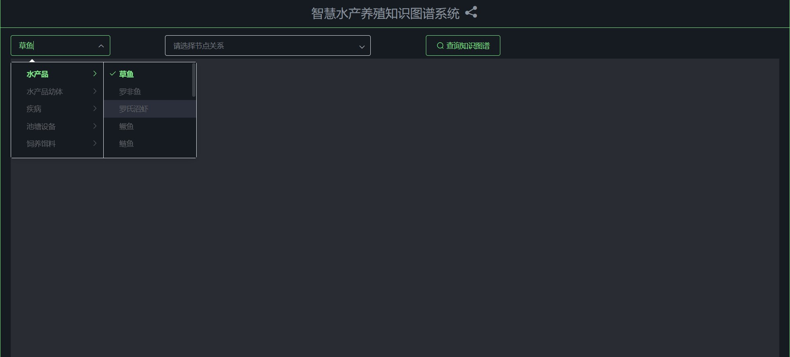
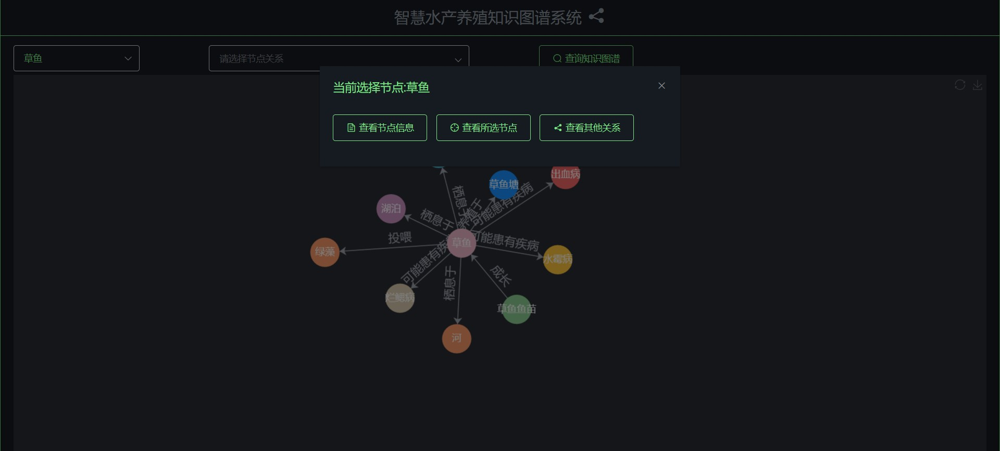

## 项目简介
本课题内容为智慧水产养殖知识图谱的构建。通过收集水产养殖的数据，设计数据模式，构建知识图谱系统，展示三元组，描述水产实体之间的关系，对农业水产养殖现代化提供支持，对养殖户实际生产有很大的帮助。
## 使用说明
在下拉框1中选择节点或输入节点名称

在下拉框2中选择节点关系（可不选）

点击“查询知识图谱“按钮查询关系图谱

点击节点可选择查看节点详细信息、重新查询所选节点的关系图谱、将所选节点的其他关系添加到当前图谱中

查看节点详细信息

将所选节点的其他关系添加到当前图谱中

## 技术栈
### 前端
- Vue  
- ElementUI  
- axios  
- Echarts  
### 后端
- SpringBoot  
- Neo4j
## 部署方式
1. 在电脑上安装neo4j  
2. 导入项目  
3. 将doc中的`graph_backup.dump`文件放在neo4j安装路径的backup目录下，然后在neo4j安装路径的bin目录下通过cmd运行`neo4j-admin load --from=../backup/graph_backup.dump --database=graph.db --force`，将备份数据导入数据库  
4. 在neo4j的bin目录下通过cmd运行`neo4j console`命令，启动neo4j服务
5. 配置application.yaml中的neo4j数据库的账号和密码
6. 运行项目，访问`localhost:8080/knowledge-graph/page/home.html`  

## 注意
1.springboot版本为**1.5.12.RELEASE**，如果版本过高会有bug（未解决）

